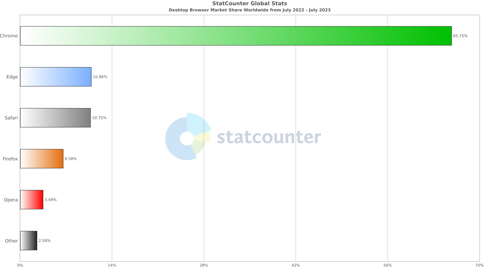
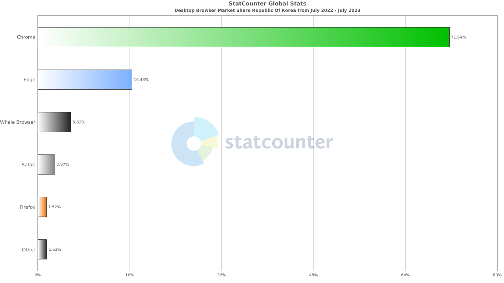
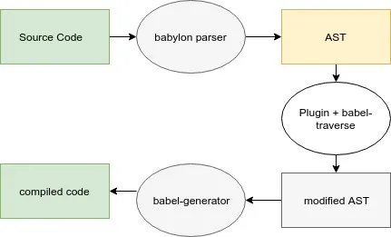
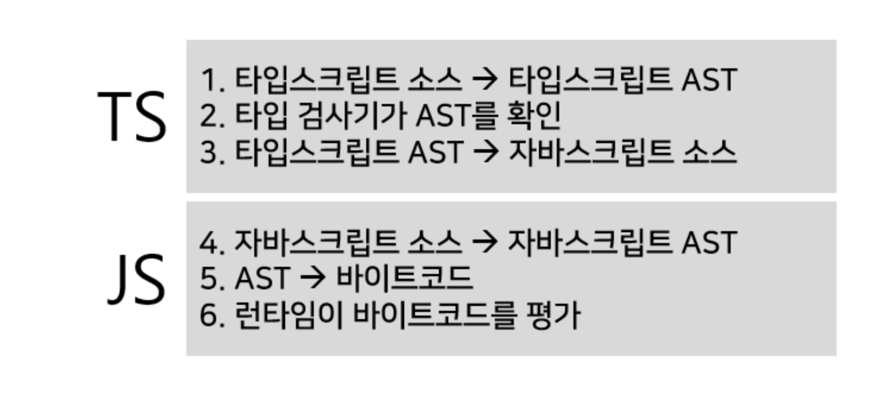

# Babel & Polyfill 그리고 Typescript

목차

1. 바벨은 무엇인가
2. 폴리필은 무엇인가
3. Babel과 TS의 차이

---

## Babel이란?

> Babel is a JavaScript compiler.
>
> [https://babeljs.io/](https://babeljs.io/)

Babel은 현재 및 이전 브라우저 또는 환경에서 ECMAScript 2015+(ES6+) 코드를 이전 버전과 호환되는 JavaScript 버전으로 변환하는 데 주로 사용되는 툴체인입니다.

더 정확히 말하자면 JS를 JS로 컴파일하는 소스 대 소스 컴파일러 즉 트랜스파일러(transpiler)라고 불립니다.

그런데 JS는 인터프리터 언어인데 왜 컴파일러가 필요하지? 란 의문이 떠오릅니다.

**왜 JS를 JS로 변환하는 과정이 필요할까요?**

_최신 ECMAscript 기능을 이전 버전 브라우저에서 호환성을 고려하여 변환하는 작업이 필요합니다._

웹 트래픽 분석 웹 사이트 스탯 카운터의 지난 1년간 세계 및 국내 브라우저 점유율은 아래와 같습니다.





IE가 지원 종료된 지금은 비중이 낮지만 이전에는 2019년 기준 11%를 차지할 정도로 하위 호환성을 고려해야 하는 환경이었습니다.

하지만 바벨을 사용해서 ES6+문법을 ES5로 변환한다고 해서 모든 브라우저에 호환되지는 않습니다.

다시 말해서 ES6에 추가된 Promise, async, 화살표 함수, class Set/Map 등의 문법이 모두 바벨에 의해 컴파일 되지 않습니다.

```javascript
// ES6로 작성한 코드
const arrowFunc = () => {};

const aPromise = new Promise();

const spreadOperator = [...[1, 2, 3], ...[4, 5, 6]];

const aSet = new Set(1, 2, 3);

const includesMethod = [1, 2, 3].includes("1");
```

```javascript
// 컴파일 후의 코드
var arrowFunc = function arrowFunc() {};

var aPromise = new Promise();

var spreadOperator = [1, 2, 3].concat([4, 5, 6]);

var aSet = new Set(1, 2, 3);

var includesMethod = [1, 2, 3].includes("1");
```

ES5 이하를 지원하는 브라우저에서 변환되지 않은 ES6에서 새로 추가된 객체 및 함수 Promise, Set, Array.prototype.includes를 읽어낼 수 없습니다.

여기서 Polyfill을 사용하여 프로그램이 처음 시작할 때, 지원하지 않는 기능들을 지원합니다.

## Polyfill(폴리필)이란?

> "polyfill은 기본적으로 지원하지 않는 이전 브라우저에서 최신 기능을 제공하는 데 필요한 코드 (일반적으로 웹의 JavaScript)입니다."
>
> [mdn](https://developer.mozilla.org/ko/docs/Glossary/Polyfill)

바벨은 최신 ES6+ 문법을 ES5로 바꾸어주는 것이고, polyfill은 브라우저가 이해할 수 없는 코드에 대하여, 이해할 수 있는 코드 소스를 제공하는 것입니다.

babel은 이러한 polyfill 을 손쉽게 지원하기 위해 babel-polyfill기능을 지원합니다.

babel은 컴파일시에 실행되고 babel-polyfill 은 런타임에 실행됩니다

@babel/preset-env에서 자동으로 폴리필을 삽입하도록 설정할 수 있습니다

## 무엇을 컴파일하고 무엇을 폴리필하는가?

새로운 객체, 메서드, 함수가 아니라 문법의 경우 바벨이 컴파일 합니다.

- const, let
- spread operator
- arrow function
- class
- destructuring

다음의 경우 컴파일될 수 없고, 폴리필이 필요합니다.

- ES5의 global namespace(window)에 존재하지 않는 것은 컴파일 하지 못 한다.
- 새로운 객체 (Promise, IntersectionObserver, Set, Map …)
- 기존 객체의 새로운 메서드 (Array.prototype.includes, Object.entries …)
- 새로운 함수 (fetch)

정리하자면, ES5 환경의 전역 객체에 존재하지 않는 객체, 메서드, 함수는 바벨이 컴파일해줄 수 가 없고 폴리필이 필요합니다.

## 바벨의 동작 구분

```javascript
(foo, bar) => foo + bar;
```

```javascript
"use strict"(function (foo, bar) {
  return foo + bar;
});
```

바벨의 컴파일 과정은 3단계로 구분됩니다.

##### 1 단계: 파싱(Parsing)

소스 코드를 추상 구문 트리 (AST)로 변환하는 과정을 수행합니다.

컴파일러에서 자료 구조로 사용되며 컴파일러의 syntax parsing 단계의 트리로 표현된 결과물입다. @babel/parser(aka. bablyon)의 parse 함수를 사용하여 AST로 파싱 할 수 있습니다.

AST는 소스코드의 각 구문과 각 코드간의 관계를 모두 서술하고 있습니다.

[https://astexplorer.net/](https://astexplorer.net/) 에서 소스코드를 AST로 변환할 수 있습니다.

```javascript
// 명확성을 위해 축약된 AST
{
    "program": {
        "body": [
            {
                "type": "ExpressionStatement",
                "expression": {
                    "type": "ArrowFunctionExpression",
                    "params": [
                        {
                            "type": "Identifier",
                            "name": "foo"
                        },
                        {
                            "type": "Identifier",
                            "name": "bar"
                        }
                    ],
                    "body": {
                        "type": "BinaryExpression",
                        "left": {
                            "type": "Identifier",
                            "name": "foo"
                        },
                        "operator": "+",
                        "right": {
                            "type": "Identifier",
                            "name": "bar"
                        }
                    }
                }
            }
        ]
    }
}
```

##### 2 단계: 변환(Transformation)

1단계에서 파싱한 AST를 각 브라우저 환경에 맞는 결과로 변환하는 작업을 수행합니다

이 단계에서 plugin 또는 preset(plugin 배열)에 의해 처리됩니다. 이때 사용되는 plugin들은 @babel/traverse을 사용하여 AST를 순회하는 과정에서 각 부분들이 어떻게 변환되고 정의 되어야 하는지를 기록합니다.

새롭게 생성된 AST입니다.

```javascript
{
    "program": {
        "type": "Program",
        "body": [
            {
                "type": "ExpressionStatement",
                "expression": {
                    "type": "Literal",
                    "value": "use strict"
                }
            },
            {
                "type": "ExpressionStatement",
                "expression": {
                    "type": "FunctionExpression",
                    "async": false,
                    "params": [
                        {
                            "type": "Identifier",
                            "name": "foo"
                        },
                        {
                            "type": "Identifier",
                            "name": "bar"
                        }
                    ],
                    "body": {
                        "type": "BlockStatement",
                        "body": [
                            {
                                "type": "ReturnStatement",
                                "argument": {
                                    "type": "BinaryExpression",
                                    "left": {
                                        "type": "Identifier",
                                        "name": "foo"
                                    },
                                    "operator": "+",
                                    "right": {
                                        "type": "Identifier",
                                        "name": "bar"
                                    }
                                }
                            }
                        ]
                    },
                    "parenthesizedExpression": true
                }
            }
        ]
    }
}
```

##### 3 단계: 코드생성(Generation)

2단계에서 생성한 새로운 AST를 바탕으로 @babel/generator를 통하여 실제 브라우저 환경에 맞는 소스코드로 변환하는 과정이 이뤄집니다.

트랜스파일 과정을 그림으로 표현하면 아래와 같습니다.


## 바벨을 적용해 보자

##### 1. 필요 패키지 설치

```bash
npm install --save-dev @babel/core @babel/cli @babel/preset-env
```

@babel/core

- 바벨의 핵심 기능 모듈 (parsing, traverse, generator => transformSync)

@babel/cli

- @babel/core에 대한 인터페이스

@babel/preset-env

- 최신 JS를 지원하기 위한 모든 플러그인의 집합

##### 2. configuration 설정

```json
// ./src/babel.config.json

{
  "presets": [
    [
      "@babel/preset-env",
      {
        "targets": {
          "edge": "17",
          "firefox": "60",
          "chrome": "67",
          "safari": "11.1"
        }
      }
    ]
  ]
}
```

cli를 통해 preset 옵션을 모두 전달하는 대신 config 파일을 사용하여 옵션을 전달할 수 있습니다.

##### 3. script명령어 등록

```json
// package.json
{
  "scripts": {
    "test": "echo \"Error: no test specified\" && exit 1",
    // target dir digest dir --plugin option
    "compile": "babel src -d dist"
  }
}
```

preset은 미리 정해진 플러그인 집합으로. preset을 사용하면 코드에 존재하는 다른 ES2015+ 기능에 대한 플러그인을 하나씩 추가하지 않아도 됩니다.

##### 4. plugin으로 코드 변환하기

npm run complie

```javascript
// ./src/index.js
(foo, bar) => foo + bar;

// ./dist/index.js
("use strict");

(function (foo, bar) {
  return foo + bar;
});
```

##### 5. Polyfill

polyfill을 사용하는 방법은 세 가지가 있습니다.

1. babel/polyfill 사용

   ```bash
   npm install --save @babel/polyfill
   ```

   --save 옵션을 사용하는 이유는 폴리필은 런타임에 필요한 기능을 주입하기 때문입니다.

   @babel/polyfill 모듈을 사용하면 모든 폴리필을 가져온다. 즉, 불필요한 폴리필 또한 가져와져 번들 사이즈가 커질 수 있습니다.

2. core-js에서 필요한 폴리필 직접 import 하여 사용

   ```bash
   npm install core-js
   ```

   ```javascript
   import "core-js/actual/array/from";
   import "core-js/actual/array/group";
   import "core-js/actual/set";
   import "core-js/actual/promise";
   import "core-js/actual/structured-clone";
   import "core-js/actual/queue-microtask";
   ```

   어떤 폴리필이 필요한지 알고 있어야 하고 직접 import 해야 하기 때문에 휴먼 에러가 발생할 수 있습니다.

3. @Babel.preset-env에서 제공하는 옵션 사용

   사용하는 기능과 target 브라우저에서 누락된 기능에 대한 변환 및 폴리필만 포함합니다.

   target 대상 환경에 누락된 기능이 있는지 모든 코드를 검사한 후 필요한 폴리필만 포함하는 "useBuiltIns": "usage" 추가

   ```json
   // babel.config.json
   {
     "presets": [
       [
         "@babel/preset-env",
         {
           "targets": {
             "edge": "17",
             "firefox": "60",
             "chrome": "67",
             "safari": "11.1"
           },
           "useBuiltIns": "usage",
           "corejs": "3.6.5"
         }
       ]
     ]
   }
   ```

## Babel과 TS의 차이

##### Typescript

> TypeScript is JavaScript with syntax for types.
>
> [https://www.typescriptlang.org/](https://www.typescriptlang.org/)

> JavaScript의 슈퍼셋(Superset)
>
> [https://namu.wiki/w/TypeScript](https://namu.wiki/w/TypeScript)

왜 쓸까?

타입 시스템 기반 개발자 간의 상호작용 및 코드 자동 완성이나 잘못된 변수/함수 사용에 대한 에러 알림같은 풍부한 피드백을 바탕으로한 생산성 향상을 위해 사용합니다.

TS와 JS의 구문분석 차이점

```typescript
(foo: number, bar: number): number => foo + bar;
```

TS AST viewer

```javascript
[
  factory.createExpressionStatement(
    factory.createArrowFunction(
      undefined,
      undefined,
      [
        factory.createParameterDeclaration(
          undefined,
          undefined,
          factory.createIdentifier("foo"),
          undefined,
          factory.createKeywordTypeNode(ts.SyntaxKind.NumberKeyword),
          undefined
        ),
        factory.createParameterDeclaration(
          undefined,
          undefined,
          factory.createIdentifier("bar"),
          undefined,
          factory.createKeywordTypeNode(ts.SyntaxKind.NumberKeyword),
          undefined
        ),
      ],
      factory.createKeywordTypeNode(ts.SyntaxKind.NumberKeyword),
      factory.createToken(ts.SyntaxKind.EqualsGreaterThanToken),
      factory.createBinaryExpression(
        factory.createIdentifier("foo"),
        factory.createToken(ts.SyntaxKind.PlusToken),
        factory.createIdentifier("bar")
      )
    )
  ),
];
```

```typescript
interface IHomePageProps {
  data: string;
  pathparams: string[];
}
```

```javascript
factory.createInterfaceDeclaration(undefined, factory.createIdentifier("IHomePageProps"), undefined, undefined, [
  factory.createPropertySignature(
    undefined,
    factory.createIdentifier("data"),
    undefined,
    factory.createKeywordTypeNode(ts.SyntaxKind.StringKeyword)
  ),
  factory.createPropertySignature(
    undefined,
    factory.createIdentifier("pathparams"),
    undefined,
    factory.createArrayTypeNode(factory.createKeywordTypeNode(ts.SyntaxKind.StringKeyword))
  ),
]);
```

https://ts-ast-viewer.com/ 에서 확인 할 수 있습니다.
참고 https://github.com/Microsoft/TypeScript/wiki/Using-the-Compiler-API



타입스크립트는 컴파일 시점에서 AST의 분석을 통해 타입을 정적으로 추론함으로 자바스크립트의 동적 타입 변환에 의한 에러를 방지할 수 있습니다.

출처

- [https://mhk-bit.medium.com/babel-under-the-hood-63e3fb961243](https://mhk-bit.medium.com/babel-under-the-hood-63e3fb961243)
- [https://velog.io/@chltjdrhd777/Typescript%EC%99%80-AST](https://velog.io/@chltjdrhd777/Typescript%EC%99%80-AST)
- [https://moonformeli.tistory.com/28](https://moonformeli.tistory.com/28)
- [https://babeljs.io/docs/usage](https://babeljs.io/docs/usage)
- [https://velog.io/@suyeon9456/Babel](https://velog.io/@suyeon9456/Babel)
- [https://medium.com/naver-place-dev/javascript-typescript-%EC%BD%94%EB%93%9C%EB%A5%BC-%EC%A0%95%EC%A0%81-%EB%B6%84%EC%84%9D%ED%95%98%EB%8A%94-%EB%B0%A9%EB%B2%95-b3a471c9620](https://medium.com/naver-place-dev/javascript-typescript-%EC%BD%94%EB%93%9C%EB%A5%BC-%EC%A0%95%EC%A0%81-%EB%B6%84%EC%84%9D%ED%95%98%EB%8A%94-%EB%B0%A9%EB%B2%95-b3a471c9620)
- [https://bravenamme.github.io/2020/02/12/what-is-babel/](https://bravenamme.github.io/2020/02/12/what-is-babel/)
- [https://happysisyphe.tistory.com/49](https://happysisyphe.tistory.com/49)
